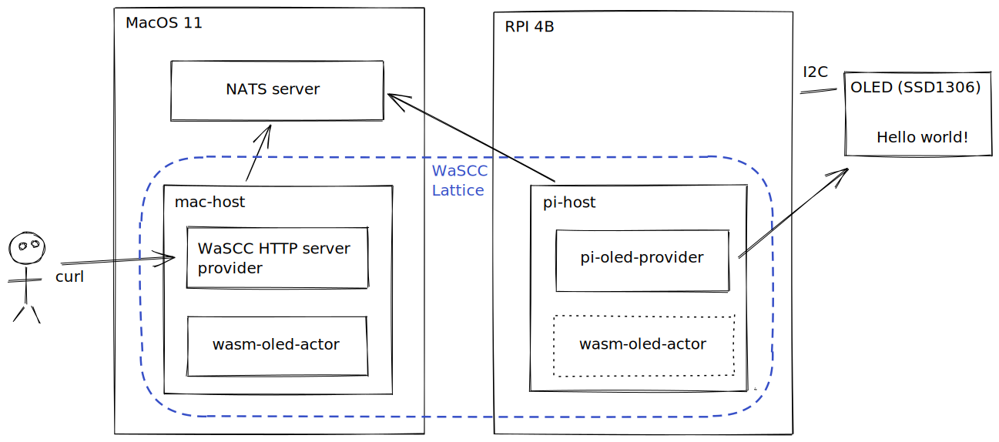

# Raspberry Pi with WaSCC

This is a demo running WaSCC lattice on MacOS and Raspberry Pi 4B



## The setup

1. Raspberry Pi 4B, 8GB

   1. Rust `1.50.0-nightly`
   2. Rust Analyzer – `aarch64` builds are currently only available on nightly (`rustup component add rust-analyzer-preview`)

2. OLED display with SSD1306 display driver

   1. [MakerHawk OLED Display Module, SSD1306, 128x64](https://smile.amazon.co.uk/gp/product/B0777HHQDT)
   2. Solder the header pins onto the OLED board
   3. Use jumper leads to these pins on the Pi:
      1. `VCC` - pin 1
      2. `GND` - pin 6
      3. `SCL` - pin 5
      4. `SDA` - pin 3

3. NATS server on the mac:

   ```sh
   brew install nats-server
   brew services start nats-server
   ```

4. VSCode with these extensions
   1. [Remote SSH](https://code.visualstudio.com/docs/remote/ssh)
   2. [Rust Analyzer](https://marketplace.visualstudio.com/items?itemName=matklad.rust-analyzer)

## Run it

1. Clone this repo on both the Pi and your Mac.

2. Find the IP address of your Mac:

   ```sh
   ipconfig getifaddr en0
   ```

3. Connect VSCode to the Pi over SSH (_cmd-shift-P_ then `Remote-SSH: Connect to Host`) or connect over SSH with a terminal.

4. On the Pi:

   ```sh
   (
      cd pi_oled_provider
      make
   )
   (
      cd pi_host
      make
   )
   ```

5. On the Mac:

   ```sh
   (
      cd wasm_oled_actor
      make keys
      make
   )
   (
      cd mac_host
      make NATS_IP=192.168.121.180 # set NATS_IP to the IP of your Mac (see step 2)
   )
   ```
