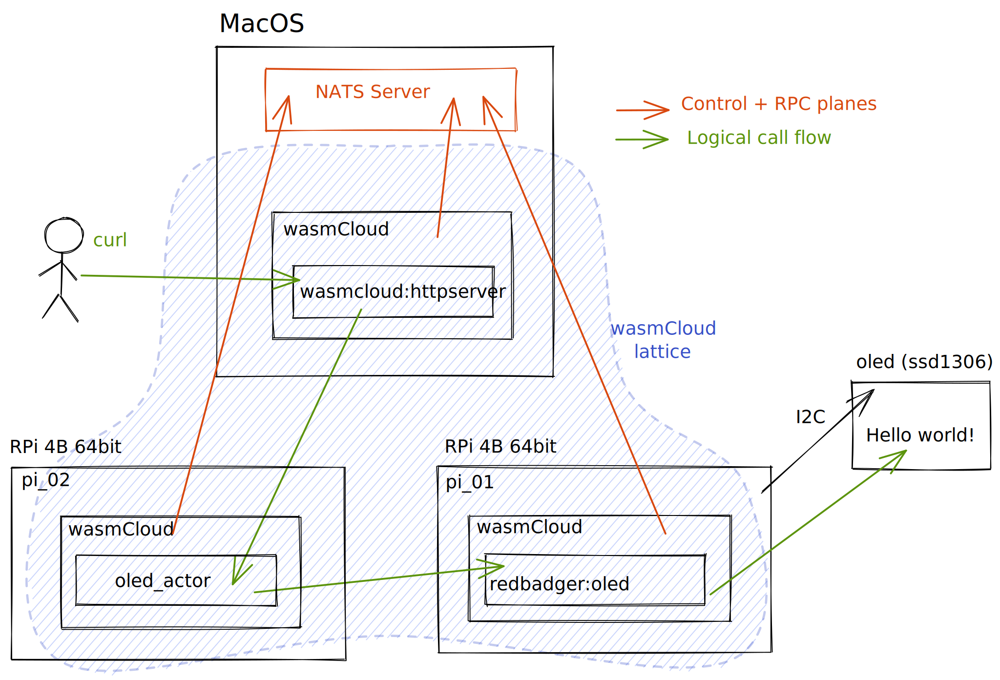

# Raspberry Pi wasmcloud Demo

This is a demo of a wasmcloud [lattice](https://www.wasmcloud.dev/reference/lattice) running across an Apple MacBook Pro and 2 x Raspberry Pi 4B.

> _A lattice is a seamless, distributed unit of compute that can self-form atop any combination of cloud, edge, and physical infrastructure._

In this example, the lattice is made of three [wasmcloud](https://wasmcloud.dev/) nodes, one on the Mac and one on each Pi. However it would work just as well with one Pi, simply collapse `pi_01` and `pi_02` together as you go.

The Mac node hosts an HTTP server provider that forwards incoming requests to a sandboxed [WASM](https://webassembly.org/) actor, which can run on any node, but in our case runs on `pi_02`.

The WASM actor contains our "business" logic. It is signed and only given permissions to talk with the HTTP server provider and the OLED provider. The latter is dynamically linked at runtime into the node running on `pi_01`, where it natively controls an OLED display.



## The setup

1. Raspberry Pi 4B, 8GB

   1. Rust `1.50`
   2. Rust Analyzer – `aarch64` builds are currently only available on nightly (`rustup component add rust-analyzer-preview`)
   3. I2C enabled in `sudo raspi-config`

2. OLED display with SSD1306 display driver

   1. [MakerHawk OLED Display Module, SSD1306, 128x64](https://smile.amazon.co.uk/gp/product/B0777HHQDT)
   2. Header pins need soldering onto the OLED board
   3. Jumper leads to these pins on the Pi:
      1. `VCC` - pin 1
      2. `GND` - pin 6
      3. `SCL` - pin 5
      4. `SDA` - pin 3

3. NATS server on the Mac:

   ```sh
   brew install nats-server
   brew services start nats-server
   ```

4. VSCode with these extensions

   1. [Remote SSH](https://code.visualstudio.com/docs/remote/ssh) - useful for writing code directly on a Pi.
   2. [Rust Analyzer](https://marketplace.visualstudio.com/items?itemName=matklad.rust-analyzer) - essential :-)

5. [`wash`](https://github.com/wascc/wash) cli installed on the Mac:

   ```sh
   cargo install wash-cli --force

   # or
   brew tap wasmcloud/wasmcloud
   brew install wasmcloud wash
   ```

## Build

Build the actor and the provider and push them to an OCI registry.

### `oled_ssd1306`

```sh
cd oled_ssd1306

make par

# note: set username, password and registry in this command before running
wash reg push -u username -p password redbadger.azurecr.io/oled_ssd1306_provider:0.0.1 target/aarch64-unknown-linux-gnu/release/oled-ssd1306-provider.par.gz
```

### `oled_actor`

```sh
cd oled_actor

make

# note: set username, password and registry in this command before running
wash reg push -u username -p password redbadger.azurecr.io/oled_actor:0.0.1 ./target/wasm32-unknown-unknown/release/oled_actor_s.wasm
```

## Run it

1. Find the IP address of your Mac:

   ```sh
   ipconfig getifaddr en0
   ```

2. Install wasmcloud on Raspberry Pi 64bit debian:

   ```bash
   # install rust toolchain
   curl --proto '=https' --tlsv1.2 -sSf https://sh.rustup.rs | sh

   # dev tools
   sudo apt install libssl-dev libclang-dev clang-9

   # wasmcloud
   cargo install --force --git https://github.com/wasmcloud/wasmcloud --tag=v0.15.3 wasmcloud
   ```

3. On each Pi:

   ```sh
   export OCI_REGISTRY_USER=username # set your OCI registry username
   export OCI_REGISTRY_PASSWORD=password # set your OCI registry password
   wasmcloud --control-host 192.168.2.1 --rpc-host 192.168.2.1 # set IP addresses to the IP of your Mac (see step 1)
   ```

4. On the Mac:

   ```sh
   wasmcloud
   ```

   Then in another shell:

   ```sh
   wash ctl get hosts

   export HOST_MAC=NCHA34XXHEUURNNC6FMFYVBFCXST5HA2QVTRZ6IESIJCAJIM5XMLGASW # replace with ID of wasmcloud instance on MAC
   export HOST_PI_01=NCZ7Q2DBXKEAIU56LGWT47X3RC73TYFJODAOKLT2CRI5ZENTQF64NXMB # replace with ID of wasmcloud instance on PI_01
   export HOST_PI_02=NDFSZQM4DJGQJHMNOC3RIYXJ5J5YD64CIXVS3ER4UX23GJQQWDS3IGOG # replace with ID of wasmcloud instance on PI_02

   ./scripts/start.sh

   # to test
   curl -d 'Hello from wasmcloud!' http://localhost:8081
   curl -X DELETE http://localhost:8081
   ```


